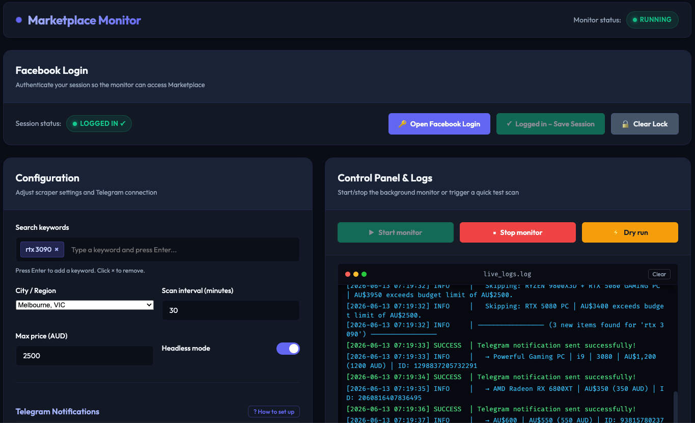

# FB Marketplace Monitor

A self-hosted Node.js tool that watches Facebook Marketplace for listings matching your keywords and sends instant **Telegram notifications** when something new appears within your budget.

Comes with a full **Web Dashboard** to manage all settings, handle Facebook login, start/stop the monitor, and watch live logs — all from your browser, no terminal required after setup.



---

## Features

- **Web Dashboard** — Configure keywords, location, budget, and Telegram credentials through a clean UI. No manual JSON editing needed.
- **Dashboard Login** — Authenticate Facebook once through a browser window launched from the dashboard. Session is saved and persists across restarts.
- **Telegram Alerts** — Sends a batch summary first (all new items in one message), then an individual message per item with a direct Marketplace link.
- **Telegram Bot Commands** — Control the monitor and update keywords directly from Telegram.
- **Auto-resume** — Monitor state is persisted. If the server restarts (code update, reboot), the monitor resumes automatically and sends you a Telegram notification.
- **Budget Filter** — Only notifies you when the price is within your set maximum.
- **Duplicate Prevention** — Tracks seen listings in `history.json` so you never get the same notification twice.
- **Human-like Behaviour** — Random scroll delays, timing, and ±1–3 minute jitter on the scan interval to avoid detection.
- **Lightweight** — Only scrapes search result pages, not individual item pages. Runs comfortably on a Raspberry Pi.
- **Docker support** — Includes `Dockerfile` and `docker-compose.yml` for easy deployment on any remote server.
- **Auto hot-reload** — Uses nodemon with polling so `git pull` on the server restarts the app automatically.
- **TypeScript** — Fully typed source with strict mode. Runs directly via `tsx`, no separate compile step needed for development.

---

## Requirements

- **Node.js** v18+ (for local/Pi setup)
- **Docker + Docker Compose** (for server deployment)
- **TypeScript** toolchain is included as a dev dependency — no global install needed

---

## Quick Start (Local / Raspberry Pi)

### 1. Install dependencies

```bash
npm install
npx playwright install chromium

# Linux / Raspberry Pi only — install Chromium system dependencies
npx playwright install-deps
```

### 2. Start the dashboard

```bash
npm start          # runs tsx src/server.ts directly
# or for development with auto-reload:
npm run dev
```

Open **http://localhost:3000** in your browser (or `http://<server-ip>:3000` from another device on the same network).

### 3. Log in to Facebook

1. Go to the **Facebook Login** section at the top of the dashboard.
2. Click **Open Facebook Login** — a browser window will open on the machine running the server.
3. Log in to your Facebook account, complete 2FA/CAPTCHA if prompted.
4. Once you see the Facebook home feed, click **Logged in – Save Session** on the dashboard.

> **Headless server (no display)?** Do the login step on your local Mac/PC first, then copy the `fb_profile/` folder to your server. The saved session will be picked up automatically.

### 4. Configure & start monitoring

1. Fill in your **keywords**, **city**, **max price (AUD)**, and **Telegram credentials** in the Configuration panel.
2. Click **Save settings**.
3. Click **Start monitor** — the monitor runs in the background and sends Telegram alerts on new matches.

---

## Telegram Setup

1. Open Telegram and message **@BotFather** → send `/newbot` → follow prompts to get your **Bot Token**.
2. Message your new bot (send any text, e.g. `hello`).
3. On the dashboard, open the **"? How to set up"** guide next to the Telegram section — click **Open getUpdates in browser** to automatically look up your **Chat ID**.
4. Paste both values into the form and click **Save settings** → **Test Telegram**.

### Telegram Bot Commands

Once configured, you can control the monitor directly from Telegram:

| Command | Description |
| --- | --- |
| `/status` `/s` | Show monitor state, keyword, next scan time |
| `/start` | Start the monitor |
| `/stop` | Stop the monitor |
| `/keyword <text>` `/k <text>` | Replace the current keyword (e.g. `/k rtx 4090`) |
| `/maxprice <amount>` `/mp <amount>` | Set max price in AUD — `0` = no limit (e.g. `/mp 1500`) |
| `/help` `/h` | List all commands |

### Webhook Setup (optional — recommended for instant command response)

By default the bot won't receive commands. To enable it, expose the app via HTTPS and register a webhook.

**nginx config** (add to your server's `http.conf`):

```nginx
server {
    listen 80;
    server_name static.yourdomain.com;
    return 301 https://$host$request_uri;
}

server {
    listen 443 ssl http2;
    server_name static.yourdomain.com;

    ssl_certificate /path/to/fullchain.cer;
    ssl_certificate_key /path/to/yourdomain.key;

    location /telegram-webhook {
        proxy_pass http://localhost:3000/telegram-webhook;
        proxy_http_version 1.1;
        proxy_set_header Host $host;
        proxy_set_header X-Real-IP $remote_addr;
    }

    location / { return 404; }
}
```

Then in the dashboard set **Telegram Webhook URL** to `https://static.yourdomain.com/telegram-webhook` and click **Save settings** — the webhook is registered with Telegram automatically.

---

## Deploy with Docker

```bash
# On your server
git clone <your-repo-url>
cd fb-marketplace-monitor

docker compose up -d --build
```

Dashboard will be available at `http://your-server-ip:3000`.

### Hot-reload after `git pull`

The container uses **nodemon** with filesystem polling and `tsx` as the executor. After pulling new code, the server restarts automatically within ~2 seconds — no rebuild or compile step needed:

```bash
git pull   # nodemon detects changes and restarts automatically
```

Only run `docker compose up -d --build` again when adding new npm packages.

Data that persists across container rebuilds (mounted as volumes):
| Path | Contents |
|---|---|
| `./fb_profile/` | Facebook session cookies |
| `./data/config.json` | All settings |
| `./data/history.json` | Seen listing IDs |

---

## Auto-start with PM2 (optional, non-Docker)

```bash
sudo npm install pm2 -g
pm2 start --interpreter tsx src/server.ts --name "fb-monitor"
pm2 startup
pm2 save
```

---

## Project Structure

```
.
├── src/
│   ├── server.ts        # Express app bootstrap & startup
│   ├── routes.ts        # Route-to-handler mappings
│   ├── handlers.ts      # Route handler implementations
│   ├── telegram.ts      # Telegram API helpers
│   ├── utils.ts         # State, log buffer, VNC stack utilities
│   ├── monitor.js       # Playwright scraper & Telegram notifier
│   └── public/
│       ├── index.html   # Dashboard UI
│       ├── app.js       # Dashboard frontend logic
│       └── style.css    # Dashboard styles
├── docs/
│   └── screenshot.png   # Dashboard screenshot
├── data/                # Runtime data (auto-created, not committed)
│   ├── config.json      # Settings (keywords, location, budget, Telegram)
│   └── history.json     # Seen listing IDs
├── fb_profile/          # Facebook session (not committed)
├── config.example.json  # Template for first-run config bootstrap
├── tsconfig.json        # TypeScript configuration
├── Dockerfile
├── docker-compose.yml
└── package.json
```

---

## Dashboard Overview

| Section            | Description                                                              |
| ------------------ | ------------------------------------------------------------------------ |
| **Facebook Login** | Open a login browser, save session, view session status                  |
| **Configuration**  | Keywords, city/region, scan interval, max price, headless mode, Telegram |
| **Control Panel**  | Start / Stop monitor, Dry run (scrape without notifying)                 |
| **Live Logs**      | Real-time terminal output from the scraper process                       |

---

## Disclaimer

Using automation tools on Facebook may violate their Terms of Service. Use a reasonable scan interval (15+ minutes) to reduce the risk of account restrictions. This tool is intended for personal use only.
